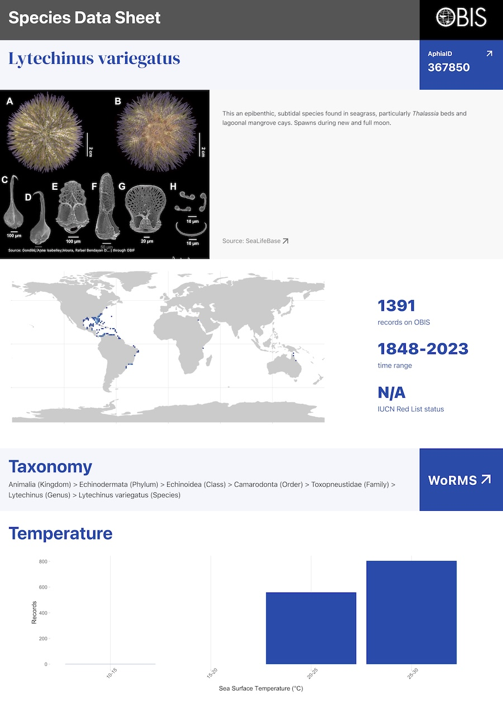
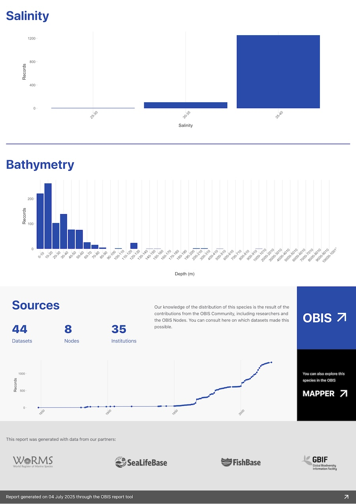

# Generate species data sheet from OBIS

It uses the Quarto rendering engine to create PDF reports based on OBIS data. The user select species based on AphiaIDs.

## Usage

On your local machine, ensure you have the Python requirements installed (requirements.txt), the R requirements installed (r-requirements.R), and the Quarto CLI installed. You will also need to have chromium installed for the PDF rendering.

Once you have the requirements installed, run the following command to start the web application:

```bash
flask run
```

And navigate to the local server URL. Alternatively, you can:

1. Directly update and render species-report-model-v3.qmd with the AphiaID of the species you want to generate a report for.
2. Run the Quarto CLI command to render the report:

```bash
quarto render species-report-model-v3.qmd --to html --output html_name -P aphiaid: the_aphiaid -P colorschema: the_color -P dynamic: the_output_type
```
colorschema can be one of the following: `blue`, `green`, `red`, `purple`, `orange`, or `gray`. The dynamic parameter can be either `static` (for printing, with QR codes instead of links) or `dynamic` (for sending by e-mail).

## Docker

To run the application in a Docker container, you can use the provided Dockerfile. Build the Docker image with:

```bash
docker compose build
```

Then run the container with:

```bash
docker compose up
```

-------



